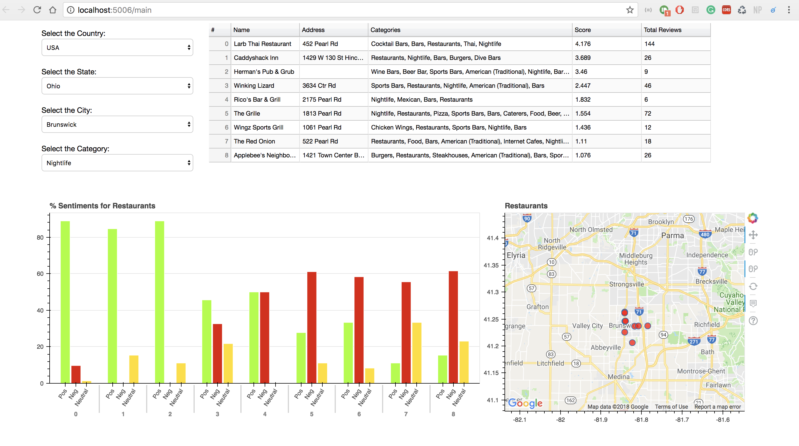
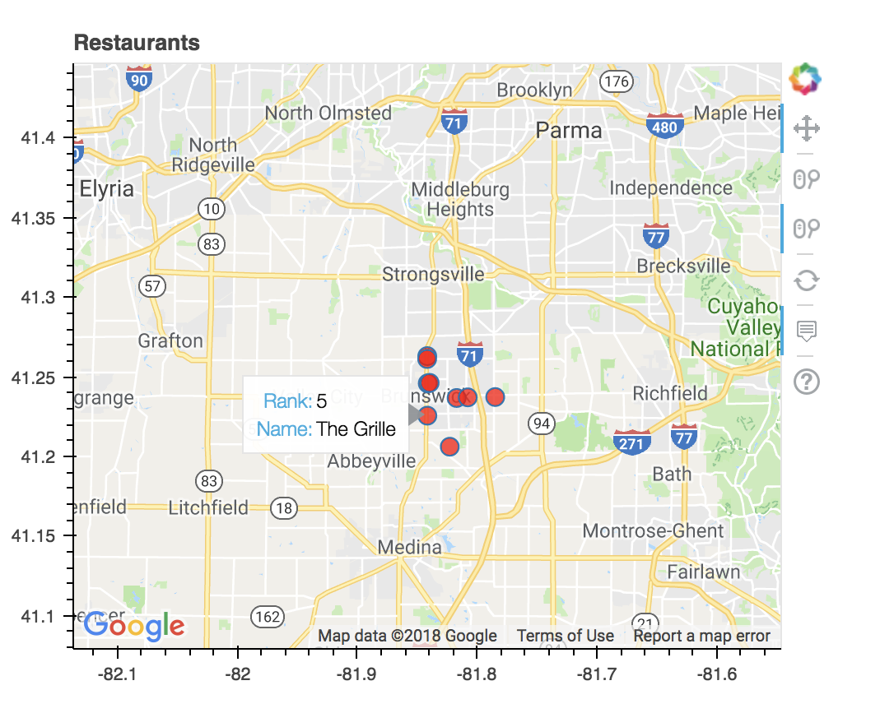

## Background ##

This project is based on the dataset which was released by Yelp for it's data challenge. 
Dataset is available at https://www.yelp.com/dataset/download

We used the SQL version to perform operations required in our project since the size of the dataset is huge (7GB).

For the code submission purpose we have exported the final table after performing the necessary operations in a txt file which is imported in the main.py file.

## Dependencies ##

 - Bokeh (version: 0.12.10)
 - pandas (version: 0.20.3)
 - numpy (version: 1.13.3)
 - nltk (version: 3.2.4)
 - sklearn (version: 0.19.1)
 - json (version: 2.0.9)
 - pymysql - for MySQL python bridge (You don't need to install pymysql since data is already exported in the txt file)


## Steps to run the code ##

1. Open the terminal in the project directory
2. Run the following command: 
    ```sh
    $ bokeh serve --show main.py
    ```
3. Once the bokeh server starts, open the browser window and goto following:
    http://localhost:5006/main
4. Enjoy!

## Results ##







Feel free to correct my mistakes by sending a PR.
Thank you.